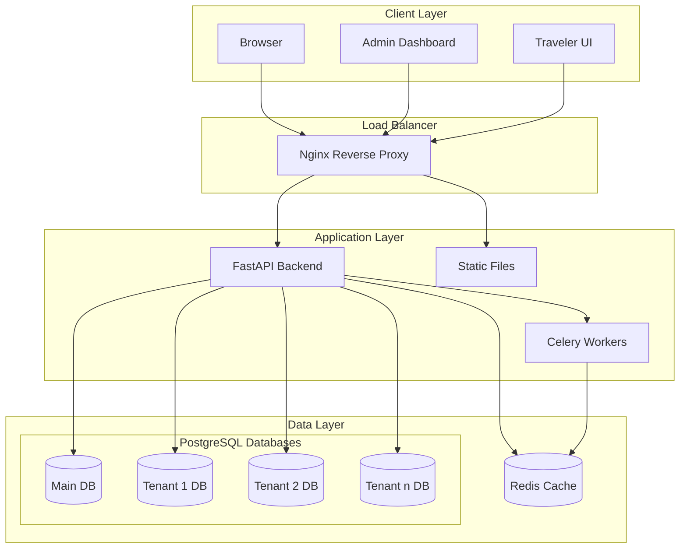
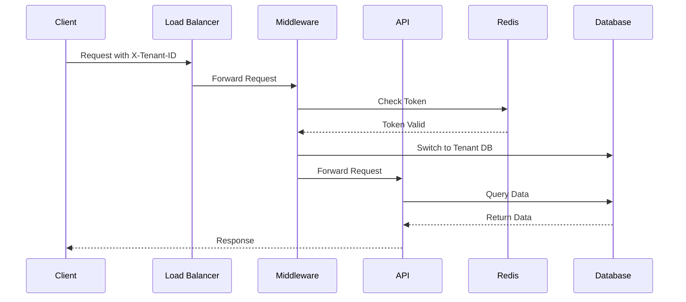
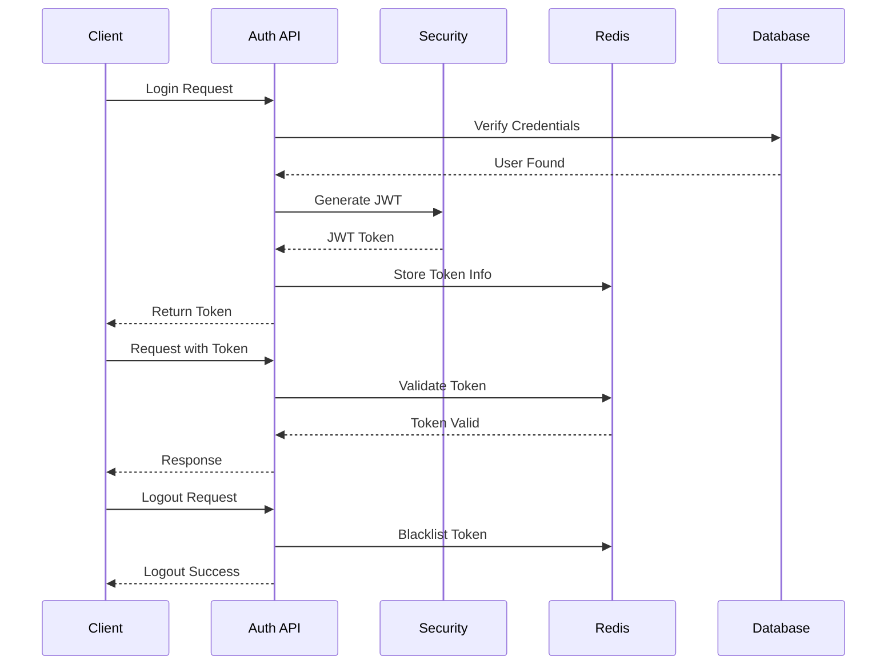
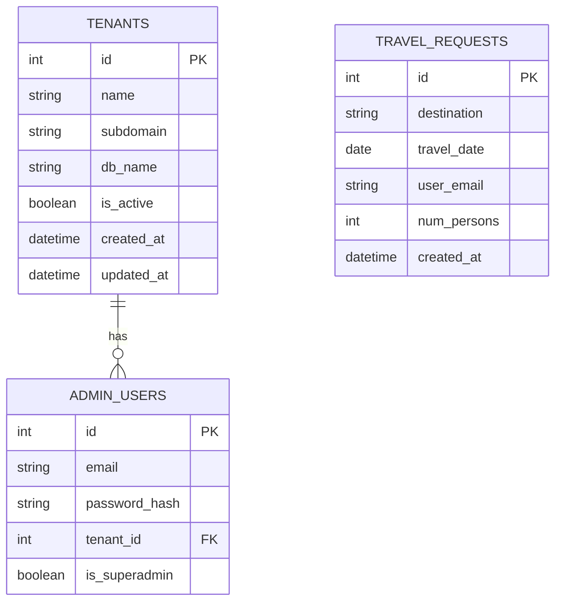
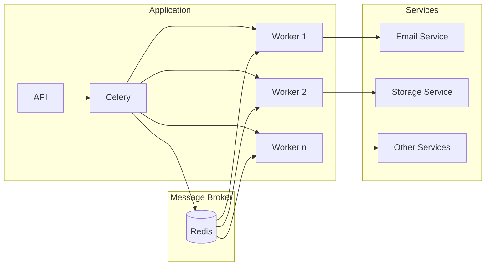
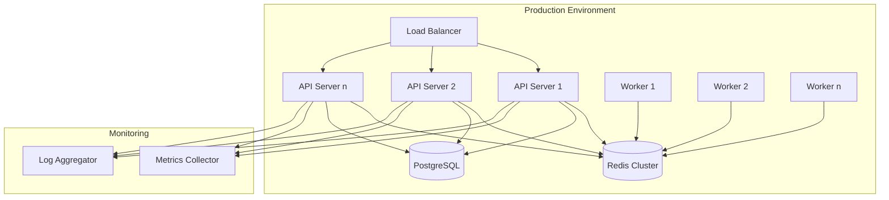

# System Architecture Diagrams

## High-Level System Architecture

## Multi-tenant Request Flow

## Authentication Flow

## Database Schema

## Background Task Flow

## Deployment Architecture

